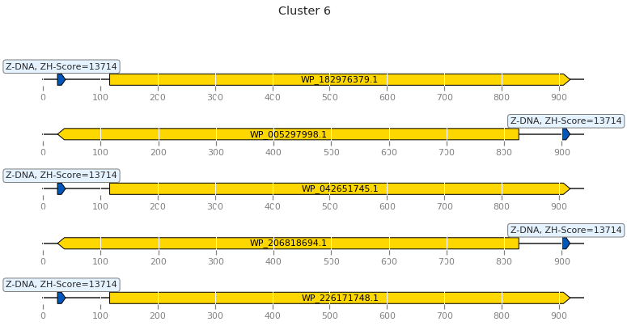
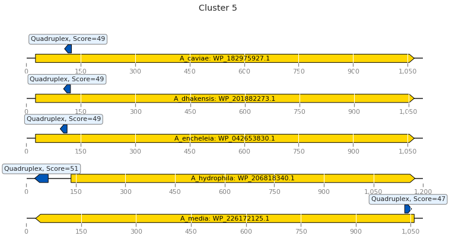

# Aeromonas
# hse22_project
Для анализа был выбран таксон Gammaproteobacteria, род Aeromonas.

[Ссылка на colab](https://colab.research.google.com/drive/1_5P72lwLC4ZLEUQdjOeQWWKfvtPD_CWY?usp=sharing)

# General info
Organisms used: *Aeromonas caviae*, *Aeromonas dhakensis*, *Aeromonas encheleia*, *Aeromonas hydrophila*, *Aeromonas mediae* 

# overview table

| Species  |  Genes number | Genome coverage | Genome length | Genome_plasmid length | Number of sequences |
|---|--|--|---|--|---|
| A_caviae | 4182.0 | 87.89 | 4507652.00 | 4565788.00 | 2.00 |
| A_dhakensis  | 4373.00 | 88.46  | 4771925.00 | 4771925.00 | 1.00 |
| A_encheleia | 4232.00  | 87.57 | 4542521.00 | 4542521.00 | 1.00 |
| A_hydrophila  | 4370.00 | 88.42 | 4766062.00 | 4766062.00 | 1.00 |
| A_media | 4183.00 | 87.77 | 4521851.00 | 4531033.00 | 2.00 |


# Number of Z-DNA regions and Z-DNA length

| Species  |  A_caviae	| A_dhakensis |	A_encheleia	| A_hydrophila | A_media |
|---|--|--|---|--|---|
| Number of Z-DNA regions| 15841 |	17892 |	16293 |	17802 |	14705 | 
| Z-DNA length  | 73393	| 82446	| 74504	| 81658 |	68094 |


*Z-DNA in promoters visualization*
|   |   |
|---|---|
|  |   |
|   |   |
|   |    |
|   |    |


## Multiple protein alignment
Files are in the folder *aligment*, one of alignements is provided here

<details>
<summary>Cluster 1 alignment</summary>

```
WP_042880284.1      MLTVRAARADDLGAIVKLERYCFPPEVAFGRSRWHYLLNQAKGRTLLLQDEKAQVMGYVS
WP_041206513.1      MLTVRAARTDDLGAIVKLERYCFPPEVAFGRSRWHYLLSHARGRTLLLLDEKAQLMGYLS
WP_042651955.1      MLTLRAARTDDLGAIVKLERYCFPPEVAFGRSRWHYLLTQAKGRTLLLLDDKAQLMGYLS
WP_226014131.1      MLTVRAARTDDLGAIVKLERYCFPPEVAFGRSRWHYLLTQAKGRTLLVLDQQEQLMGYLC
WP_024946079.1      MLTVRAARTDDLGAIVKLERYCFPPEVAFGRSRWHYLLTHAKGRTLLVLDQQEQLMGYLC
                    ***:****:*****************************.:*:*****: *:: *:***:.

WP_042880284.1      VLEHKGWDRLIIQTLAIRWTVRRQGWARRLLEQVIREGREAGWGAIRLEVADANPEARTL
WP_041206513.1      VLEHRGWNRLIIQTLAIRWTVRRQGWARRLLEQVIREGREAGWGAIRLEVADANPEAQTL
WP_042651955.1      VLEHRGWDRLVIQTLAIRWTVRRQGWARRMLEQVIQEGRQAGWGAIRLEVADANPEAQTL
WP_226014131.1      LLEHRGWDRLIIQTLAIRWTIRRQGWARRLLEQVVREGKEAGWGAIRLEVGDANEEAQAL
WP_024946079.1      LLEHRGWDRLIIQTLAIRWTIRRQGWARRLLEQVIQEGKEAGWGAIRLEVGDANEEAQAL
                    :***:**:**:*********:********:****::**::**********.*** **::*

WP_042880284.1      YQGLGFRPGVRLPDYYGPGQHAHRLVLALGDERQEPS--
WP_041206513.1      YHGLGFRPRLRLPDYYGPGQHAHRLVLALKQA-------
WP_042651955.1      YQRLGFRPRLRLPDYYGPGLHAHRLVLPLGSGEQGLA--
WP_226014131.1      YRGLGFRPRQKLLDYYGHGQHAHRLVLKLAGERREEERG
WP_024946079.1      YRELGFRPRQKLPDYYGHGQHAHRLVLALKQA-------
                    *: *****  :* **** * ******* *          

```
 
</details>

# Предсказание G-квадруплексов

## Number of quadruplex regions and quadruplex length

| Species  |  A_caviae	| A_dhakensis |	A_encheleia	| A_hydrophila | A_media |
|---|--|--|---|--|---|
| Number of quadruplex regions | 3919	| 2998 |	3149 |	2815 |	3302 | 
| Quadruplex length  | 121057 |	91507 |	96600 |	85445 |	101636 |

**Quadruplexes visualization**
|   |   |
|---|---|
|  |   |
|   |   |
|   |    |
|   |    |

R-scripts used for the analysis can be gained via
!wget https://raw.githubusercontent.com/narek01/hse22_project/main/pqsfinder.r
!wget https://raw.githubusercontent.com/narek01/hse22_project/main/configure.r

